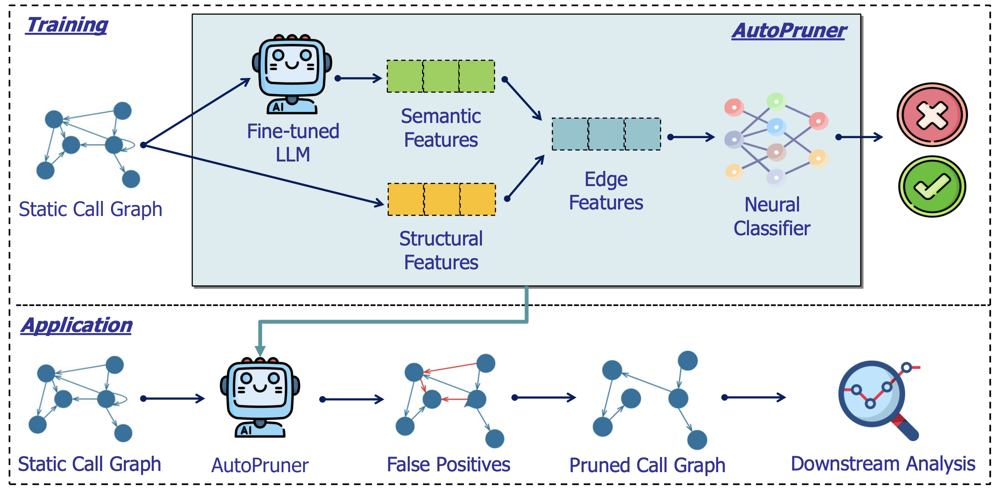
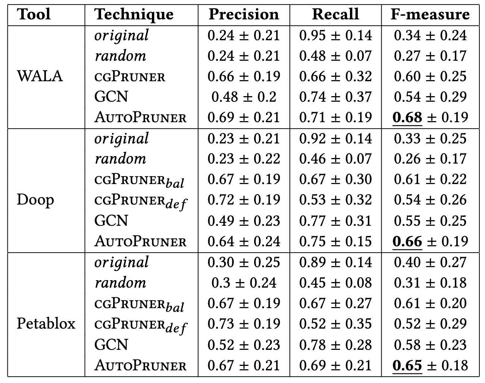
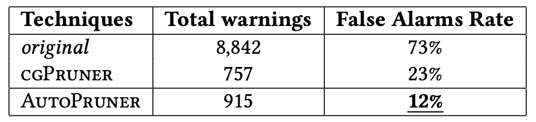

# ⚙️AutoPruner✂️
*by Thanh Le-Cong, Hong Jin Kang, Truong Giang Nguyen, Stefanus Agus Haryono, David Lo, Xuan-Bach D. Le, Quyet Thang Huynh*

    <a href="https://dl.acm.org/doi/abs/10.1145/3540250.3549175">
    <a href="https://arxiv.org/abs/2209.03230">
     
    <a href="https://zenodo.org/records/6369874">
    

## 💥 Approach
Constructing a static call graph requires trade-offs between soundness and precision. Program analysis techniques for constructing call graphs are unfortunately usually imprecise. To address this problem, researchers have recently proposed call graph pruning empowered by machine learning to post-process call graphs constructed by static analysis. A machine learning model is built to capture information from the call graph by extracting structural features for use in a random forest classifier. It then removes edges that are predicted to be false positives. Despite the improvements shown by machine learning models, they are still limited as they do not consider the source code semantics and thus often are not able to effectively distinguish true and false positives. 

In this paper, we present a novel call graph pruning technique, AutoPruner, for eliminating false positives in call graphs via both statistical semantic and structural analysis. Given a call graph constructed by traditional static analysis tools, AutoPruner takes a Transformer-based approach to capture the semantic relationships between the caller and callee functions associated with each edge in the call graph. To do so, AutoPruner fine-tunes a model of code that was pre-trained on a large corpus to represent source code based on descriptions of its semantics. Next, the model is used to extract semantic features from the functions related to each edge in the call graph. AutoPruner uses these semantic features together with the structural features extracted from the call graph to classify each edge via a feed-forward neural network.

  

## 📈 Experimental Results

### Effectiveness on Call Graph Pruning
Our empirical evaluation on a benchmark dataset of real-world programs shows that AutoPruner outperforms every baseline approach, including the state-of-the-art call
graph pruner. The call graphs pruned by AutoPruner improves over the state-of-the-art baseline by up to 13% in F1 when the baseline is optimally balanced and by up to 25% when it is not. Overall, AutoPruner outperforms
all baselines.

  

### Effectiveness on Downstream Tasks

The call graph produced by AutoPruner leads to improvements in both null pointer analysis and monomorphic call site detection. Based on the call graph from WALA, AutoPruner decreases the false alarm rate from null pointer analysis by 11%.

  

